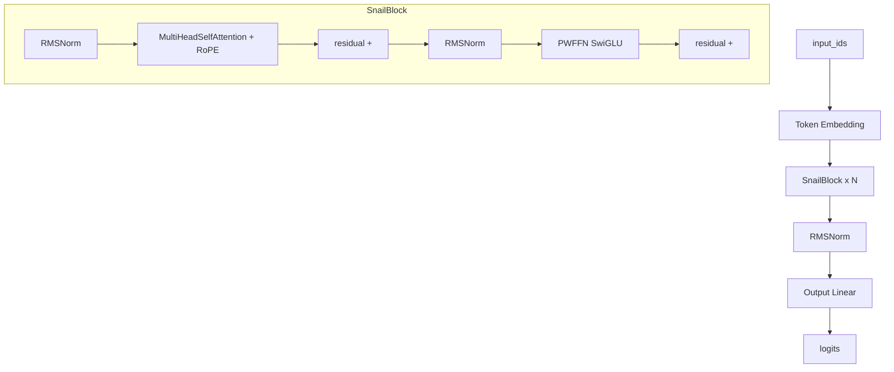

> [返回首页](README.md) | [上一篇: 分词器与数据预处理](01-tokenizer-data.md) | [下一篇: 训练流程](03-training.md)

# 训练流程②：模型架构

## 1. 架构总览

MiniSnail 采用 **decoder-only Transformer（Pre-Norm 结构）**。整个模型由一个 Token Embedding、N 个堆叠的 SnailBlock、一个最终的 RMSNorm 以及一个输出线性层组成。每个 SnailBlock 内部按 "RMSNorm → 多头自注意力（带 RoPE）→ 残差 → RMSNorm → PWFFN（SwiGLU）→ 残差" 的顺序执行。

下图为前向数据流：



默认配置（来自 [config.py](file:///workspace/src/minisnail/config.py#L16-L26)）：`vocab_size=6400`，`context_length=512`，`d_model=512`，`num_layers=4`，`num_heads=16`，`d_ff=1344`，`rope_theta=10000.0`，`rms_norm_eps=1e-6`。因此 `d_k = d_model // num_heads = 32`，模型共有 `N = 4` 个 SnailBlock。

## 2. SnailModel

参考 [model.py](file:///workspace/src/minisnail/model.py#L179-L297)。`SnailModel` 是整个模型的顶层容器，在 `__init__` 中（约 [L192-L206](file:///workspace/src/minisnail/model.py#L192-L206)）依次构建 5 个组件：

1. **Token Embedding**：`nn.Embedding(vocab_size, d_model)`，将输入的 token id 映射为 `d_model` 维向量。
2. **RoPE**：`RotaryPositionalEmbedding(rope_theta, d_k, context_length)`，在所有 block 之间**共享**同一个旋转位置编码实例。
3. **blocks**：`nn.ModuleList`，包含 N 个 [SnailBlock](file:///workspace/src/minisnail/model.py#L151-L177)，构造时把上面共享的 `rope_embedding` 传入每个 block。
4. **Final norm**：`nn.RMSNorm(d_model, eps=rms_norm_eps)`，最后一个 block 输出后再做一次 RMSNorm。
5. **Output**：`nn.Linear(d_model, vocab_size)`，将隐藏向量投影回词表空间，得到 logits。

[forward](file:///workspace/src/minisnail/model.py#L208-L218) 的执行顺序为：embedding → 循环调用每个 block → final norm → output 线性层，最终返回 logits，形状为 `[..., seq_len, vocab_size]`。

此外，工厂函数 [init_model](file:///workspace/src/minisnail/model.py#L12-L17)(config, device, dtype) 封装了 `SnailModel` 的构造逻辑，调用方只需传入 `SnailConfig` 即可拿到模型实例。`generate` 与 `chat` 等推理相关方法将在 04-inference.md 中说明。

## 3. SnailBlock

参考 [SnailBlock](file:///workspace/src/minisnail/model.py#L151-L177)。这是标准的 **Pre-Norm** 残差块，[forward](file:///workspace/src/minisnail/model.py#L164-L177) 步骤如下：

1. `_X = norm1(X)`：先做 RMSNorm（Pre-Norm，先归一化再进注意力）。
2. `_X = multihead_attention(_X)`：带 RoPE 的因果多头自注意力。
3. `X1 = X + _X`：第一个残差连接。
4. `__X = norm2(X1)`：对残差结果再做一次 RMSNorm。
5. `__X = ffn(__X)`：PWFFN（SwiGLU）前馈网络。
6. `output = X1 + __X`：第二个残差连接，得到 block 输出。

SnailBlock 内部包含的子模块：`multihead_attention`（[MultiHeadSelfAttention](file:///workspace/src/minisnail/model.py#L109-L149)）、`ffn`（[PWFFN](file:///workspace/src/minisnail/model.py#L19-L42)）、`norm1` 与 `norm2`（均为 `nn.RMSNorm`）。

## 4. MultiHeadSelfAttention

参考 [MultiHeadSelfAttention](file:///workspace/src/minisnail/model.py#L109-L149)。

- 头维度：`d_k = d_v = d_model // num_heads`（默认 = 512 // 16 = 32）。
- 线性投影：`W_Q`、`W_K`、`W_V`、`W_O` 全部为 `nn.Linear(d_model, d_model)`。

[forward](file:///workspace/src/minisnail/model.py#L127-L149) 步骤：

1. `Q = W_Q(X)`，`K = W_K(X)`，`V = W_V(X)`：对输入做线性投影。
2. 使用 einops `rearrange` 把 `(… seq_len d_model)` 重排为 `(… num_heads seq_len d_k)`。
3. 若 `rope_embedding` 不为空，则对 Q 和 K 应用 RoPE 旋转位置编码。
4. 调用 `F.scaled_dot_product_attention(Q, K, V, is_causal=True)`，使用 PyTorch 内置的融合因果缩放点积注意力。
5. 用 `rearrange` 把 `(… num_heads seq_len d_v)` 合并回 `(… seq_len (num_heads d_v))`。
6. `output = W_O(multi_head_output)`：最终输出投影。

## 5. RotaryPositionalEmbedding (RoPE)

参考 [RotaryPositionalEmbedding](file:///workspace/src/minisnail/model.py#L44-L107)。

- [__init__](file:///workspace/src/minisnail/model.py#L45-L62)：通过静态方法 [init_cache](file:///workspace/src/minisnail/model.py#L64-L84) 预计算角度缓存，并以 `persistent=False` 的方式注册为 buffer（不随 state_dict 保存）。
- [init_cache](file:///workspace/src/minisnail/model.py#L64-L84)：
  - `theta_pow = theta ** (-arange(0, d_k, 2) / d_k)`，形状 `[d_k/2]`。
  - `i_range = arange(max_seq_len).unsqueeze(-1)`，形状 `[max_seq_len, 1]`。
  - `freqs = theta_pow * i_range`，形状 `[max_seq_len, d_k/2]`。
  - 返回 `stack(cos, sin)`，形状 `[2, max_seq_len, d_k/2]`。
- [forward](file:///workspace/src/minisnail/model.py#L86-L107)：
  - 按奇偶位置切片：`x1 = x[..., ::2]`，`x2 = x[..., 1::2]`。
  - 根据 `token_positions` 从 `angle_cache` 中查表得到对应的 `cos`、`sin`。
  - 做旋转：`x1_rot = cos * x1 - sin * x2`，`x2_rot = sin * x1 + cos * x2`。
  - `stack` 后 `flatten` 还原为 `[..., seq_len, d_k]`。

RoPE 仅在注意力中对 Q 和 K 应用。

## 6. PWFFN (SwiGLU Feed-Forward)

参考 [PWFFN](file:///workspace/src/minisnail/model.py#L19-L42)。这是 Position-Wise Feed-Forward Network，采用基于 SiLU 的 SwiGLU 结构。

三个参数均为手动创建的 `nn.Parameter`：

- `W1`：形状 `[d_ff, d_model]`
- `W2`：形状 `[d_model, d_ff]`
- `W3`：形状 `[d_ff, d_model]`

公式为：

```
FFN(x) = W2 · ( SiLU(W1 · x) ⊙ (W3 · x) )
```

[forward](file:///workspace/src/minisnail/model.py#L33-L42) 中的 einsum 运算：

- `w1x = einsum(W1, x)`，形状 `[..., d_ff]`。
- `w3x = einsum(W3, x)`，形状 `[..., d_ff]`。
- `silu = F.silu(w1x)`，即 `SiLU(W1·x)`。
- `FFNx = einsum(W2, silu * w3x)`，形状 `[..., d_model]`。

默认 `d_ff = 1344`。

## 7. RMSNorm

归一化层使用 PyTorch 内置的 `nn.RMSNorm(d_model, eps=rms_norm_eps)`，`eps = 1e-6`。在 [SnailBlock](file:///workspace/src/minisnail/model.py#L151-L177) 中作为 `norm1` 与 `norm2` 使用，并在 [SnailModel](file:///workspace/src/minisnail/model.py#L179-L297) 中作为最终归一化 `norm` 使用。

## 8. 关键超参速查表

| 超参 | 默认值 | 含义 | 来源 |
| --- | --- | --- | --- |
| vocab_size | 6400 | 词表大小 | [config.py](file:///workspace/src/minisnail/config.py#L16-L26) |
| context_length | 512 | 最大上下文长度 | [config.py](file:///workspace/src/minisnail/config.py#L16-L26) |
| d_model | 512 | 隐藏维度 | [config.py](file:///workspace/src/minisnail/config.py#L16-L26) |
| num_layers | 4 | SnailBlock 层数 | [config.py](file:///workspace/src/minisnail/config.py#L16-L26) |
| num_heads | 16 | 注意力头数 | [config.py](file:///workspace/src/minisnail/config.py#L16-L26) |
| d_k = d_v | 32 | 每头维度（d_model // num_heads） | [config.py](file:///workspace/src/minisnail/config.py#L16-L26) |
| d_ff | 1344 | 前馈网络中间维度 | [config.py](file:///workspace/src/minisnail/config.py#L16-L26) |
| rope_theta | 10000.0 | RoPE 的 theta 基底 | [config.py](file:///workspace/src/minisnail/config.py#L16-L26) |
| rms_norm_eps | 1e-6 | RMSNorm 的 eps | [config.py](file:///workspace/src/minisnail/config.py#L16-L26) |
