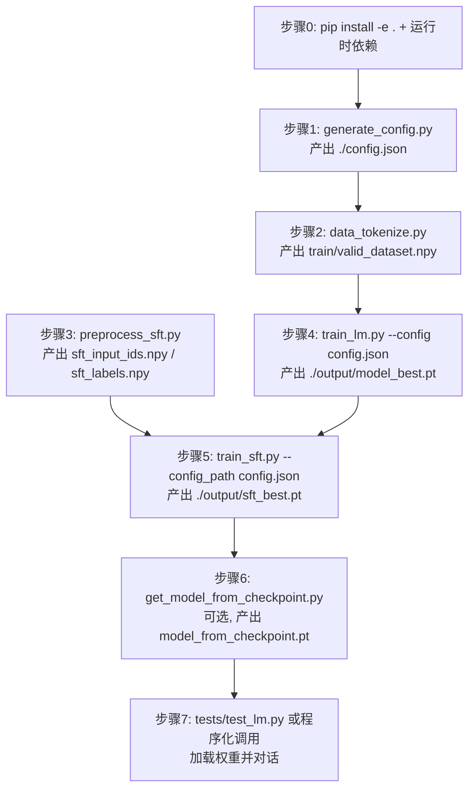

> [返回首页](README.md) | [上一篇: 推理与生成](04-inference.md)

# 训练流程⑤：项目运行方式

本页给出从零到可对话的完整可执行步骤，按大模型训练流程顺序组织。每一步对应 `scripts/` 下真实脚本。

---

## 步骤 0：环境准备与依赖安装

- Python >= 3.10（见 [pyproject.toml](file:///workspace/pyproject.toml#L8) 中的 `requires-python`）。
- 以可编辑模式安装本包，使 `minisnail` 命名空间在当前 Python 环境可直接 `import`：

```bash
pip install -e .
```

- 运行时依赖**未声明在 [pyproject.toml](file:///workspace/pyproject.toml)** 中，需要手动安装：

```bash
pip install torch numpy transformers einops jaxtyping rich matplotlib wandb datasets tqdm
```

各依赖一句话用途如下（详细说明见 [README 依赖清单](README.md)）：

| 依赖 | 用途 |
| --- | --- |
| `torch` | 模型定义、张量计算与训练循环主体 |
| `numpy` | 数据预处理、token 数组与统计 |
| `transformers` | 加载预训练 tokenizer（`AutoTokenizer`）与 chat template |
| `einops` | 注意力与 RoPE 中的张量形状变换 |
| `jaxtyping` | 模型层的类型注解 |
| `rich` | 终端彩色输出（`minisnail.debug.console`） |
| `matplotlib` | 训练 / 验证 loss 曲线绘图 |
| `wandb` | 实验跟踪、训练指标记录与断点续训 |
| `datasets` | SFT 数据加载（`load_dataset("json", ...)`） |
| `tqdm` | 数据预处理进度条 |

---

## 步骤 1：生成默认配置

- 脚本：[generate_config.py](file:///workspace/scripts/generate_config.py#L1-L7) — 实例化一个 `SnailConfig()`，调用 `to_json` 写出 `./config.json`。
- 命令：

```bash
python scripts/generate_config.py
```

- 产物：`./config.json`，全部为默认值（参见 [config.py](file:///workspace/src/minisnail/config.py#L19-L23)）：

  `vocab_size=6400`、`d_model=512`、`num_layers=4`、`num_heads=16`、`context_length=512`、`epochs=6000`、`batch_size=32` 等。训练前可手工编辑此文件做调参。

- 说明：训练脚本在没有显式传 `--config` / `--config_path` 时，会自动 `SnailConfig.from_json("config.json")` 加载同目录的 `./config.json`（见 [train_lm.py L314-L319](file:///workspace/scripts/train_lm.py#L314-L319) 与 [train_sft.py L322-L327](file:///workspace/scripts/train_sft.py#L322-L327)）。

---

## 步骤 2：预训练数据预处理

- 脚本：[data_tokenize.py](file:///workspace/scripts/data_tokenize.py#L1-L209)。
- 命令（默认参数，定义在 [data_tokenize.py L65-L71](file:///workspace/scripts/data_tokenize.py#L65-L71)）：

```bash
python scripts/data_tokenize.py \
  --tokenizer_path ./model/minimind \
  --data_path ./data/pretrain_t2t_mini.jsonl \
  --train_output_path ./data/train_dataset.npy \
  --valid_output_path ./data/valid_dataset.npy \
  --train_ratio 0.8 \
  --chunk_size 2000
```

- 参数表（参见 [data_tokenize.py L62-L72](file:///workspace/scripts/data_tokenize.py#L62-L72)）：

  | 参数 | 默认值 | 说明 |
  | --- | --- | --- |
  | `--tokenizer_path` | `./model/minimind` | tokenizer 加载路径 |
  | `--data_path` | `./data/pretrain_t2t_mini.jsonl` | 输入 jsonl 文件 |
  | `--train_output_path` | `./data/train_dataset.npy` | 训练集输出 |
  | `--valid_output_path` | `./data/valid_dataset.npy` | 验证集输出 |
  | `--train_ratio` | `0.8` | 训练集字节数占比 |
  | `--chunk_size` | `2000` | 多进程编码的批大小（行） |
  | `--num_workers` | `cpu_count()` | 进程池大小，未指定时取 CPU 数 |

- 产物：两份**裸 int32 二进制流**（虽然扩展名是 `.npy`，实际是 `arr.tofile(...)` 写出的连续 int32，读取侧用 `np.memmap` 直接映射），分别对应训练 / 验证集。内部实现细节见 [01-tokenizer-data.md](01-tokenizer-data.md)。

---

## 步骤 3：SFT 数据预处理

- 脚本：[preprocess_sft.py](file:///workspace/scripts/preprocess_sft.py#L1-L249)。
- 命令（默认参数，定义在 [preprocess_sft.py L234-L239](file:///workspace/scripts/preprocess_sft.py#L234-L239)）：

```bash
python scripts/preprocess_sft.py \
  --data_path ./data/sft_t2t_mini.jsonl \
  --tokenizer_root ./model/minimind \
  --max_length 512 \
  --output_dir ./data
```

- 参数表（参见 [preprocess_sft.py L233-L240](file:///workspace/scripts/preprocess_sft.py#L233-L240)）：

  | 参数 | 默认值 | 说明 |
  | --- | --- | --- |
  | `--data_path` | `./data/sft_t2t_mini.jsonl` | 输入 SFT jsonl 文件 |
  | `--tokenizer_root` | `./model/minimind` | tokenizer 根目录 |
  | `--max_length` | `512` | 单样本最大序列长度 |
  | `--output_dir` | `./data` | 输出目录 |
  | `--num_samples` | `None` | 调试时只取前 N 条，如 `1000` |

- 产物：`./data/sft_input_ids.npy` 与 `./data/sft_labels.npy`，由真实的 `np.save` 写出（见 [preprocess_sft.py L222-L223](file:///workspace/scripts/preprocess_sft.py#L222-L223)），shape 为 `[num_samples, max_length]`，dtype 为 `int32`，labels 中非回答部分用 `-100` 屏蔽。细节见 [01-tokenizer-data.md](01-tokenizer-data.md)。

---

## 步骤 4：预训练

- 脚本：[train_lm.py](file:///workspace/scripts/train_lm.py#L1-L357)。
- 命令（显式指定配置，见 [train_lm.py L306-L308](file:///workspace/scripts/train_lm.py#L306-L308)）：

```bash
python scripts/train_lm.py --config config.json
```

  也可以省略 flag 直接复用同目录的 `./config.json`：

```bash
python scripts/train_lm.py
```

- 参数（参见 [train_lm.py L305-L314](file:///workspace/scripts/train_lm.py#L305-L314)）：`--config`，配置 JSON 路径。

- wandb：需要先 `wandb login`。默认 entity=`lettle-hong`、project=`MiniSnail`（见 [config.py L84-L85](file:///workspace/src/minisnail/config.py#L84-L85)），首次运行会新建一次 run，从 checkpoint 续训时复用同一 `wandb_id`（见 [train_lm.py L329-L350](file:///workspace/scripts/train_lm.py#L329-L350)）。

- 产物（落盘到 `config.data.save_model_dir`，默认 `./output/`）：
  - `./output/model_best.pt`：验证 loss 创新低时保存的 `state_dict`（见 [train_lm.py L254](file:///workspace/scripts/train_lm.py#L254)）。
  - `./output/model_new.pt`：训练正常结束时的最终权重（见 [train_lm.py L297-L298](file:///workspace/scripts/train_lm.py#L297-L298)）。
  - `./output/checkpoint.pt`：`KeyboardInterrupt` 或异常时保存的完整 checkpoint（含 optimizer、`global_step`、`epoch`、`wandb_id`，见 [train_lm.py L266-L285](file:///workspace/scripts/train_lm.py#L266-L285)）。
  - `./output/train_loss_curve.png`、`./output/valid_loss_curve.png`：loss 曲线。
  - 训练机制详见 [03-training.md](03-training.md)。

- 断点续训：在 `config.json` 中将 `training.use_checkpoint` 置为 `true`，并把 `training.from_checkpoint` 指向 `./output/checkpoint.pt`，重新执行同样的命令即可（加载逻辑见 [train_lm.py L322-L326](file:///workspace/scripts/train_lm.py#L322-L326)）。

---

## 步骤 5：SFT 微调

- 脚本：[train_sft.py](file:///workspace/scripts/train_sft.py#L1-L365)。
- 命令（见 [train_sft.py L313-L316](file:///workspace/scripts/train_sft.py#L313-L316)）：

```bash
python scripts/train_sft.py --config_path config.json
```

- 参数（参见 [train_sft.py L313-L327](file:///workspace/scripts/train_sft.py#L313-L327)）：`--config_path`，配置 JSON 路径。

> 注意 flag 名不对称：**`train_lm.py` 用 `--config`，`train_sft.py` 用 `--config_path`**。这是源码中真实存在的不一致（分别见 [train_lm.py L307](file:///workspace/scripts/train_lm.py#L307) 与 [train_sft.py L315](file:///workspace/scripts/train_sft.py#L315)），并非笔误，迁移命令时请勿搞混。

- 建议在 `config.json` 中设 `training.from_weight=./output/model_best.pt`，从预训练权重起步 SFT（加载逻辑见 [train_sft.py L145-L147](file:///workspace/scripts/train_sft.py#L145-L147)）。

- 产物：
  - `./output/sft_best.pt`：验证 loss 创新低时保存（见 [train_sft.py L273-L275](file:///workspace/scripts/train_sft.py#L273-L275)）。
  - `./output/sft_new.pt`：训练结束时的最终权重（见 [train_sft.py L304-L307](file:///workspace/scripts/train_sft.py#L304-L307)）。
  - `./output/checkpoint.pt`：`KeyboardInterrupt` 时的 checkpoint（见 [train_sft.py L287-L292](file:///workspace/scripts/train_sft.py#L287-L292)）。
  - `./output/train_loss_curve.png`、`./output/valid_loss_curve.png`。
  - 训练机制详见 [03-training.md](03-training.md)。

---

## 步骤 6：从检查点提取模型权重（可选）

- 脚本：[get_model_from_checkpoint.py](file:///workspace/scripts/get_model_from_checkpoint.py#L1-L10)。
- 命令（见 [get_model_from_checkpoint.py L4-L6](file:///workspace/scripts/get_model_from_checkpoint.py#L4-L6)）：

```bash
python scripts/get_model_from_checkpoint.py --checkpoint ./output/checkpoint.pt
```

- 参数：`--checkpoint`，默认值 `./output/checkpoint.pt`（见 [get_model_from_checkpoint.py L5](file:///workspace/scripts/get_model_from_checkpoint.py#L5)）。

- 产物：`./output/model_from_checkpoint.pt`，仅含 `model_state_dict`（不含 optimizer、step、wandb_id 等元数据，见 [get_model_from_checkpoint.py L8-L10](file:///workspace/scripts/get_model_from_checkpoint.py#L8-L10)），可直接用于推理而不必携带完整 checkpoint。

---

## 步骤 7：推理与对话

提供两种方式。

### Option A：跑通 smoke test

- 脚本：[tests/test_lm.py](file:///workspace/tests/test_lm.py#L1-L59)。它会加载 `./config.json`、tokenizer、模型与权重，然后调用 `generate_text`（见 [tests/test_lm.py L33-L55](file:///workspace/tests/test_lm.py#L33-L55)）。
- 将 [tests/test_lm.py L39](file:///workspace/tests/test_lm.py#L39) 处的 `model_dir` 指向自己的权重（例如 `./output/sft_best.pt` 或 `./output/model_best.pt`），并按需修改 [tests/test_lm.py L52](file:///workspace/tests/test_lm.py#L52) 的 prompt，然后运行：

```bash
python tests/test_lm.py
```

### Option B：程序化调用

```python
from minisnail.config import SnailConfig
from minisnail.tokenizer import get_tokenizer
from minisnail.model import init_model
from minisnail.generate import generate_text
import torch

config = SnailConfig.from_json("./config.json")
config.training.from_weight = "./output/sft_best.pt"
tokenizer = get_tokenizer(config)
model = init_model(config)
model.load_state_dict(torch.load(config.training.from_weight, weights_only=False))
model.to(torch.device(config.system.device)); model.eval()
generate_text(model, tokenizer, "你好，请介绍一下你自己", config)
# 或多轮对话:
# print(model.chat("你好", tokenizer))
```

- generate / chat 的内部实现详见 [04-inference.md](04-inference.md)。

---

## 端到端流程速查图



整体训练流程主线详见 [README 训练流程主线串联图](README.md)。
